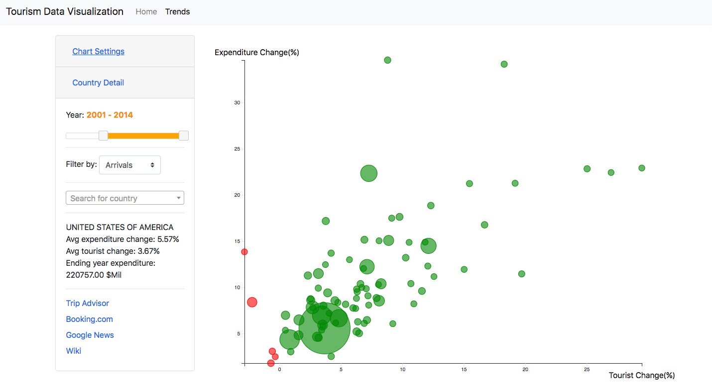

# Global Tourism Visualization Web Application ✈️

Over the past few decades, international tourism has contributed substantially to the overall growth of the world economy, as well as the growth of some local economies. These trends lend themselves to a visual analytics framework for analysis in two key ways: some travellers may want to find new vacation locations which are less popular tourist destinations, and some businesses may want to identify up-and-coming tourism destinations in which investments in real estate and/or business may lead to high profits. 

We contribute an **interactive analytics tool** that allows users to explore trends related to the volume of tourists to and from locations over time as well as trends related to the expenditures of tourists with these two use cases in mind. 

## Technology Stack 

HTML5, CSS3, Bootstrap, JavaScript ES6, D3, JQuery, JQuery UI, JSON.

## Data

The data are collected by the World Tourism Organization, and the dataset provides comprehensive information on international tourism worldwide and offers a selection of the latest available statistics on "arrivals of non-resident tourists/visitors" and "tourism expenditure". The dataset was last updated on January 31, 2016, and it provides inbound and outbound tourism data for 716 countries and regions, including tourism volume and expenditures (in USD), from 1995 through 2014. 

## Tasks

  * **Global trends**: Users should be able to explore a general overview of global tourism statistics. That is, the tool will provide visualizations of trends in tourism volume and expenditures over time on the global scale. Thus, the general overview should provide users with a basic idea of which destinations are more popular or more costly than others. By exploring the years, users can explore how the popular or costly destinations have changed over time.
  
  * **Country-specific trends**: When a user selects a country, they will be shown additional statistics and visualization about that country. This additional country-specific information will allow the user to identify how the country compares to the global average, and can make inferences about the popularity or cost of visiting a given country.

## Design Rantionale

  * *Why*: The why of the tasks involves determining why a task is performed; there are high-level whys (to consume information versus to produce information), mid-level whys (to search for information), and low-level whys (to query). 
         
|                  | Target Known | Target Unknown |
| ---------------- |:------------:| --------------:|
| Location Known   | lookup       | browse         |
| Location Unknown | locate       | explore        |

  * **How**: The how of the tasks involves determining how to achieve the project goals. This was done by analyzing the whys. There are two main categories of hows (manipulate and introduce) and one standalone category (encode).
  
  * **What**: The what of the design process concentrates on defining the inputs required for the task and the outputs produced by the task.
  
## Design Prototype and Development

The prototype is successfully able to answer the questions outlined from the beginning of the project: 

  * What are the global averages and trends for tourism statistics?
  
  * What are popular tourist destinations, how much do tourists spend there, and how have these statistics changed over time?
  
  * How does a specific country’s statistics compare to global averages?

### Panel 1: Home page

On the homepage in the default view, the choropleth style world map in the center of the page illustrates the differences across countries in the volume of arriving tourists for the current year (2014, the final year provided in the dataset). The user can change the year, to view departures data, or to visualize the differences in expenditures by interacting with a drop-down menu. Hovering over a country on the map will reveal additional information about the specified country. The default view will also provide graphs displaying the global averages in tourism volume and expenditure over time. These graphs change based on user inputs for years as well as arrivals/ departures.

The search bar below the world map allows users to search for and select specific countries (up to five at a time, so as not to overload the graphs) which results in the country being highlighted and the graphs (to the right of the world map) changing to country-specific graphs, showcasing the trends for volume and expenditures over time for the country and how those trends compare to the global average.

### Panel 2: Trends page

The trends page of the visualization tool has “Country Details” to highlight the growth or decline in tourism trends (both volume and expenditure) for a given country. We show this information in a bubble chart in which the x axis represents the compound annual growth rate (CAGR) (a measure of percent change) in tourism volume, the y axis represents the CAGR in expenditure, and the size of the bubble represents the tourist expenditure for the final year selected. 

Along with detailed information from the bubble chart, links to the TripAdvisor, Booking.com, Google News and Wikipedia pages for the selected country are displayed on the page.

The user can interact with the bubble chart is accompanied by selecting a start and end year (range) through a slider scale and by selecting whether to see arrivals or departures data. The year range defaults from 2008 to 2014 as we have the most data for that period. Upon hovering over a country in the bubble chart, detailed information for that country is displayed underneath the control panel on the left. 

## Authors

  * **Yaxue Guo** developed and tested line chart and bar chart.
  * **Nick Wang** developed and tested bubble chart.
  * **Nidhi Shah** designed UI and developed tooltip for map.
  * **Natasha Vázquez** processed raw data to JSON and developed map.
  

  
  